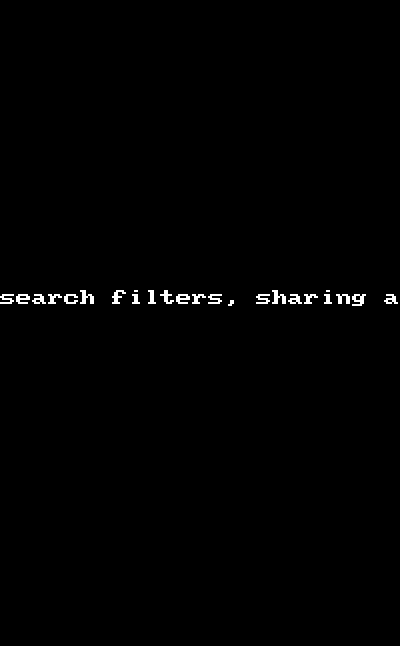

Google Search Image viewer for Android
(A simple grid view based image search for google images)

Time spent: 12hrs

Completed User stories:

  * [x] Load json data from Google Images search API endpoint.
  * [x] Create grid view with image results from the search query.
  * [x] Show title and open the image in full screen view for preview.
  * [x] User is able to endlessly scroll the list of image results
  * [x] User can tap settings icon and modify search filters and get it to apply on existing/future search requests
  * [x] The search results update immediately after returning from saving filter settings.
 
Optional user stories:

  * [x] User can share picture from image detail view
  * [x] Search from the Action bar

  

Dependencies on libraries:

I used android-async-http library for asynchronous HTTP request handling. And picasso library for loading images. 
 
Demo

Basic submission

