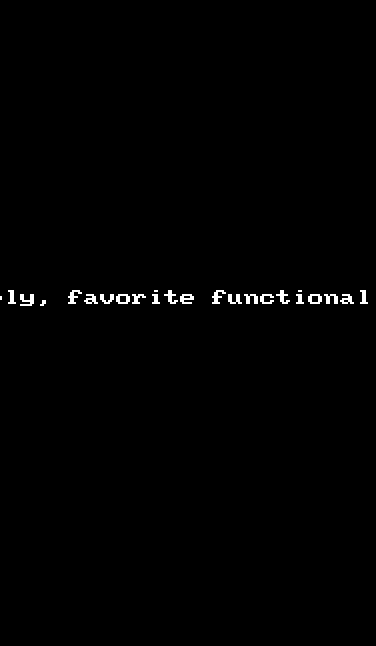
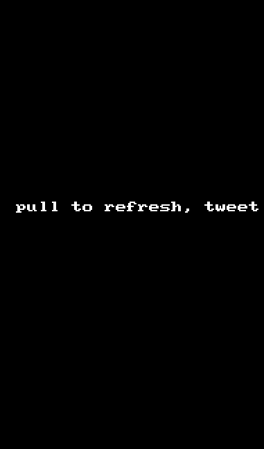

Android twitter client
======================
This is simple twitter client that shows users timeline, allows to create a post etc.

Assignment 2
============

Hours worked on: 14hrs

Required User stories:

  *  [x] User can switch between timeline and mention views using tabs
  *  -  [x] User can view their home timeline tweets.
  *  -  [x] User can view the recent mentions of their username
  *  [x] Infinite scroll
  *  [x] User can navigate to view their own profile
  *  [x] User can click on the profile image in any tweet to see another user's profile.

Optional user stories:

  *  [x] Advanced: User can "reply" to any tweet on their home timeline
  *  [x] Advanced: User can take favorite on a tweet
  *  [x] Advanced: Improve the user interface and theme the app to feel twitter branded
  *  [x] Improve the user interface and theme the app to feel twitter branded

Demo
====

Assignment 1
============

Hours worked on: 20hrs

Required User stories:

  *  [x] connect to twitter account using oauth
  *  [x] show a timeline of tweets for the user
  *  [x] infinite scrolling of tweets.
  *  [x] provide way to compose and post a tweet

Optional user stories:

  *  [x] Show links in the tweet
  *  [x] Show media images in tweet withing the stream
  *  [x] pull to refresh fetches new tweets
  *  [x] Show characters remaining when composing the tweet

Demo
====

