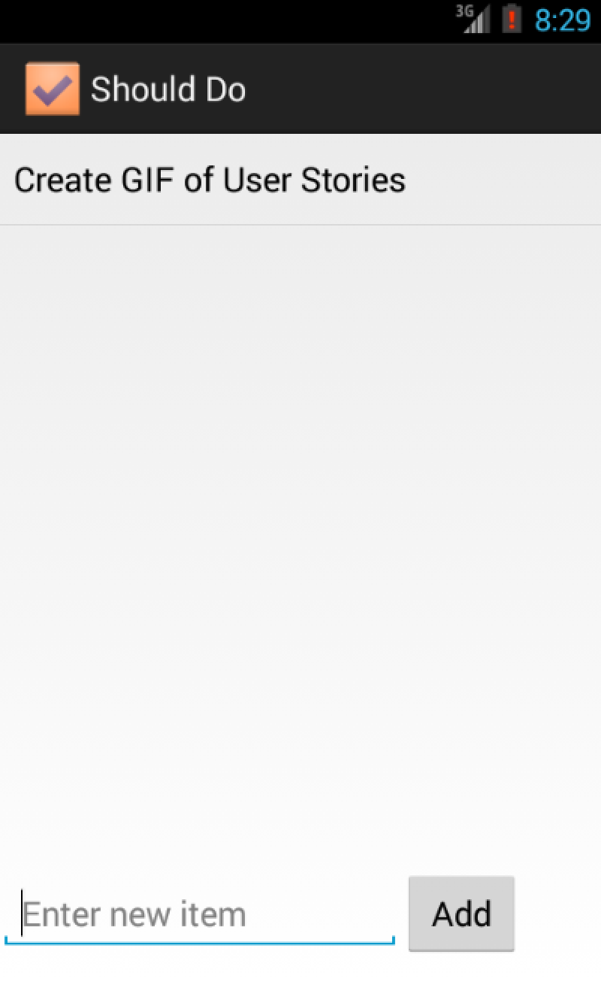

#Todo App demo
(A simple Todo management app.)

This is an Android demo application for marking down "what things I need to do?". See [CodePath tutorial](https://gist.github.com/nesquena/843228e83fdc4f5ddc4e) for detailed steps to learn how to write one. 

Time spent: 8 hours spent in total

Completed user stories:

 * [x] Required: User can view a list of items ToDo.
 * [x] Required: User can add a new ToDo item.
 * [x] Required: User can remove a ToDo item by long tapping on the item.
 * [x] Required: User can edit a ToDo item description in separate activity by tapping on the item.
 * [x] Optional: User gets feedback when a item is removed from the list.
 * [x] Optional: The items list is persisted in a sqlite database and displayed in reverse order of adding
 
 
Notes:

Walkthrough of all user stories: